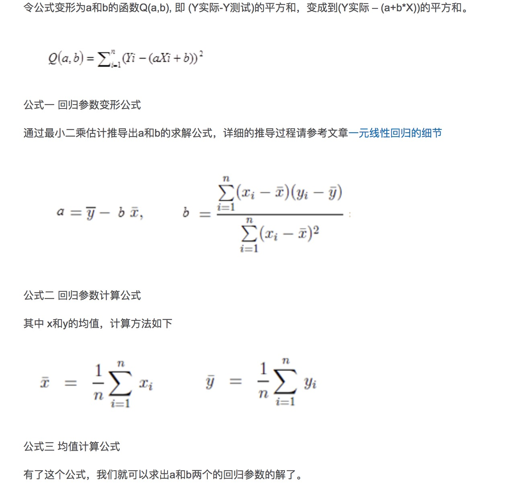
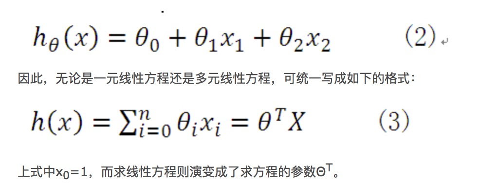
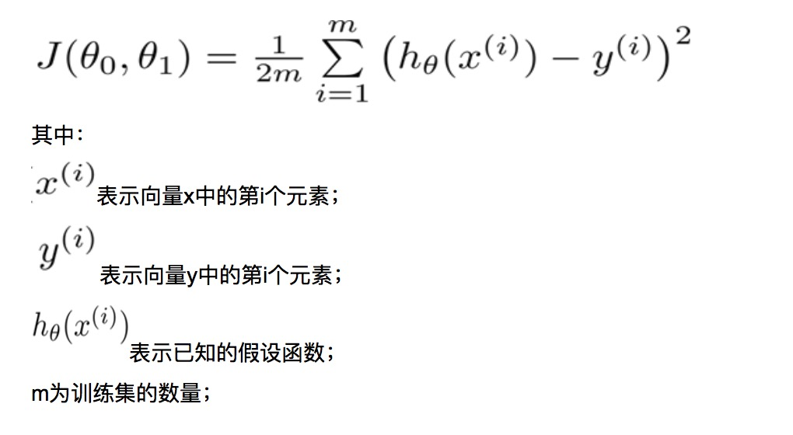

#### 基础资料
```
* 对于学术界来说，学者们更希望框架容易调试、灵活性要强、迭代要快。因此，比照现有深度学习框架的特
点，Theano、Torch可能会更加适合学术界，而D4J等可能就要更适合工业界一些，至于Caffe、Tensorflow等为代表的框架则是介于二者之间。

caffe tensorflow 比较

docker pull b.gcr.io/tensorflow/tensorflow
docker pull b.gcr.io/tensorflow/tensorflow-full
docker run -p 6888:8888 --rm -it b.gcr.io/tensorflow/tensorflow-full

sh /run_jupyter.sh

http://localhost:6888/tree#clusters

http://www.open-open.com/lib/view/open1487579427487.html
http://wiki.jikexueyuan.com/project/tensorflow-zh/get_started/os_setup.html

```
```
docker pull caffe2ai/caffe2

https://caffe2.ai/docs/getting-started.html?platform=mac&configuration=docker

```

#### tensorflow mac
```

pip install tensorflow

Collecting tensorflow
  Downloading tensorflow-1.2.1-cp27-cp27m-macosx_10_11_x86_64.whl (33.6MB)
    100% |████████████████████████████████| 33.6MB 14kB/s
Collecting bleach==1.5.0 (from tensorflow)
  Downloading bleach-1.5.0-py2.py3-none-any.whl
Collecting mock>=2.0.0 (from tensorflow)
  Downloading mock-2.0.0-py2.py3-none-any.whl (56kB)
    100% |████████████████████████████████| 61kB 31kB/s
Collecting numpy>=1.11.0 (from tensorflow)
  Downloading numpy-1.13.0-cp27-cp27m-macosx_10_6_intel.macosx_10_9_intel.macosx_10_9_x86_64.macosx_10_10_intel.macosx_10_10_x86_64.whl (4.6MB)
    100% |████████████████████████████████| 4.6MB 15kB/s
Collecting protobuf>=3.2.0 (from tensorflow)
  Downloading protobuf-3.3.0.tar.gz (271kB)
    100% |████████████████████████████████| 276kB 29kB/s
Collecting backports.weakref==1.0rc1 (from tensorflow)
  Downloading backports.weakref-1.0rc1-py2-none-any.whl
Collecting markdown>=2.6.8 (from tensorflow)
  Downloading Markdown-2.6.8.tar.gz (307kB)
    100% |████████████████████████████████| 317kB 31kB/s
Requirement already satisfied: six>=1.10.0 in /Users/yangsteven/.pyenv/versions/anaconda2-2.5.0/lib/python2.7/site-packages (from tensorflow)
Requirement already satisfied: wheel in /Users/yangsteven/.pyenv/versions/anaconda2-2.5.0/lib/python2.7/site-packages (from tensorflow)
Collecting html5lib==0.9999999 (from tensorflow)
  Downloading html5lib-0.9999999.tar.gz (889kB)
    100% |████████████████████████████████| 890kB 18kB/s
Collecting werkzeug>=0.11.10 (from tensorflow)
  Downloading Werkzeug-0.12.2-py2.py3-none-any.whl (312kB)
    100% |████████████████████████████████| 317kB 39kB/s
Collecting funcsigs>=1; python_version < "3.3" (from mock>=2.0.0->tensorflow)
  Downloading funcsigs-1.0.2-py2.py3-none-any.whl
Collecting pbr>=0.11 (from mock>=2.0.0->tensorflow)
  Downloading pbr-3.1.1-py2.py3-none-any.whl (99kB)
    100% |████████████████████████████████| 102kB 28kB/s
Requirement already satisfied: setuptools in /Users/yangsteven/.pyenv/versions/anaconda2-2.5.0/lib/python2.7/site-packages/setuptools-19.6.2-py2.7.egg (from protobuf>=3.2.0->tensorflow)
Building wheels for collected packages: protobuf, markdown, html5lib
  Running setup.py bdist_wheel for protobuf ... done
  Stored in directory: /Users/yangsteven/Library/Caches/pip/wheels/1b/42/a0/4c7343df5b629ec9c75655468dce7652b28026896b0209ba55
  Running setup.py bdist_wheel for markdown ... done
  Stored in directory: /Users/yangsteven/Library/Caches/pip/wheels/85/a7/08/33ee5cd488d0365d8bed79d1d4e5c28dd3fbfc7f6d0ad4bb09
  Running setup.py bdist_wheel for html5lib ... done
  Stored in directory: /Users/yangsteven/Library/Caches/pip/wheels/6f/85/6c/56b8e1292c6214c4eb73b9dda50f53e8e977bf65989373c962
Successfully built protobuf markdown html5lib
Installing collected packages: html5lib, bleach, funcsigs, pbr, mock, numpy, protobuf, backports.weakref, markdown, werkzeug, tensorflow
  Found existing installation: funcsigs 0.4
    Uninstalling funcsigs-0.4:
      Successfully uninstalled funcsigs-0.4
  Found existing installation: numpy 1.10.4
    DEPRECATION: Uninstalling a distutils installed project (numpy) has been deprecated and will be removed in a future version. This is due to the fact that uninstalling a distutils project will only partially uninstall the project.
    Uninstalling numpy-1.10.4:
      Successfully uninstalled numpy-1.10.4
  Found existing installation: Werkzeug 0.11.3
    Uninstalling Werkzeug-0.11.3:
      Successfully uninstalled Werkzeug-0.11.3
Successfully installed backports.weakref-1.0rc1 bleach-1.5.0 funcsigs-1.0.2 html5lib-0.9999999 markdown-2.6.8 mock-2.0.0 numpy-1.13.0 pbr-3.1.1 protobuf-3.3.0 tensorflow-1.2.1 werkzeug-0.12.2

# 试用
import tensorflow as tf
hello = tf.constant('Hello, TensorFlow!')
sess = tf.Session()
2017-07-03 11:30:23.025440: W tensorflow/core/platform/cpu_feature_guard.cc:45] The TensorFlow library wasn't compiled to use SSE4.2 instructions, but these are available on your machine and could speed up CPU computations.
2017-07-03 11:30:23.025486: W tensorflow/core/platform/cpu_feature_guard.cc:45] The TensorFlow library wasn't compiled to use AVX instructions, but these are available on your machine and could speed up CPU computations.
>>> print(sess.run(hello))
Hello, TensorFlow!


```

#### tf编程模型
[ Logistic回归、softmax回归以及tensorflow实现MNIST识别](http://blog.csdn.net/universe_ant/article/details/52745817)
[Softmax回归（使用tensorflow）](http://www.cnblogs.com/qw12/p/5962430.html)

####scikit编程模型
[scikit-learn的线性回归模型](http://www.17bigdata.com/%E3%80%90scikit-learn%E3%80%91scikit-learn%E7%9A%84%E7%BA%BF%E6%80%A7%E5%9B%9E%E5%BD%92%E6%A8%A1%E5%9E%8B.html)


#### 回归算法
```
逻辑回归（Logistic Regression）是机器学习中的一种分类模型。
sigmoid函数
LR分类器:
逻辑回归与回归分析有很多相似之处，在开始介绍逻辑回归之前我们先来看下回归分析。

回归分析（Regression Analysis)：用来描述自变量x和因变量Y之间的关系，并对因变量Y进行预测。如果预测的变量是连续的。
*【如果预测的变量是离散的，我们称其为分类（如决策树，支持向量机等），如果预测的变量是连续的，我们称其为回归】
1、变量纬度：一元回归，多元回归分析。
2、线性纬度：线性回归【对于二维空间线性是一条直线一元一次（曲线一元二次）；对于三维空间线性是一个平面，对于多维空间线性是一个超平面。】 非线性回归（逻辑回归，一般回归）
*线性回归Linear regression
一元线性回归分析的数学模型。最简单。

问题引入：房屋面积 价格。对一元、多元线性统一归纳 【参考8】【参考15】我们常称x为feature，h(x)为hypothesis；

* Cost Function（代价函数）【最小二乘法(SSE指sum of squared error)计算回归方程[参考2]【参考5】【参考6】】 . 代价函数越小，说明线性回归地越好（和训练集拟合地越好），当然最小就是0，即完全拟合.

* 计算方式
1)
求导方式：
求参数a和b，采用偏导数，函数的极值就是对应的导数为0.
求导结果【参考7】，参考1就是利用这个结果来直接计算a b 值。

2)Gradient Descent（梯度下降）

首先我们应该清楚，一个多元函数的梯度方向是该函数值增大最陡的方向。具体化到1元函数中时，梯度方向首先是沿着曲线的切线的，然后取切线向上增长的方向为梯度方向，2元或者多元函数中，梯度向量为函数值f对每个变量的导数，该向量的方向就是梯度的方向，当然向量的大小也就是梯度的大小。


法向量
批量梯度下降法（Batch Gradient Descent, BGD）；
随机梯度下降法（Stochastic Gradient Descent, SGD）；
小批量梯度下降法（Mini-Batch Gradient Descent, MBGD）。

 := 表示赋值，这是一个赋值运算符

等高线


对应就是一元回归线性方程，多元线性回归方程。具体求法见[参考1]，。


* 对于一个回归方程，如果自变量的指数大于1，那么它就是多项式回归方程。如下方程所示：y=a+b*x^2。在这种回归技术中，最佳拟合线不是直线。而是一个用于拟合数据点的曲线。

高斯消元法（或译：高斯消去法），是线性代数规划中的一个算法，可用来为线性方程组求解


线性回归

逻辑回归
回归不用在分类问题上，因为回归是连续型模型，而且受噪声影响比较大。如果非要应用进入，可以使用logistic回归。

```

* 参考1：[逻辑回归算法的原理及实现(LR)](http://bluewhale.cc/2016-05-18/logistic-regression.html)
* 参考2：[线性回归之——最小二乘法](http://sbp810050504.blog.51cto.com/2799422/1269572)
* 参考3：[机器学习经典算法之-----最小二乘法（zz）](http://www.cnblogs.com/armysheng/p/3422923.html)
* 参考4：[R语言求导](https://www.ibm.com/developerworks/cn/data/library/techarticle/dm-1604-r-function-derivative/index.html)
* 参考5：[最小二乘法的推导过程-便于记忆](https://wenku.baidu.com/view/cb956a73a45177232f60a2dc.html)
对a求导。分两步。复合函数求导。
设，u=yi-a-bxi
求和函数的导数，对里面的和函数求导和在求和。及对u^2 先求导。(u^2)'=2u , (yi-a-bxi)'=-1 ,a是变量 ，其他都是常量。常量导数为0，a的导数为1
对b变量类似。
求和函数的常量乘积，可以把常量移到外部。
求和函数的各项函数相当于对每一项求和的代数和。
* 参考6：[最小二乘法？为神马不是差的绝对值](http://blog.sciencenet.cn/blog-430956-621997.html) 正太分布 贝叶斯定理 解释。
* 参考7： 
* 参考8:[线性回归与梯度下降算法](http://www.cnblogs.com/eczhou/p/3951861.html)
* 参考9：[机器学习算法入门之(一) 梯度下降法实现线性回归](http://blog.csdn.net/titan0427/article/details/50365480)
* 参考10：[机器学习入门：线性回归及梯度下降](http://blog.csdn.net/xiazdong/article/details/7950084) 复合函数求导。
* 参考11：[对线性回归，logistic回归和一般回归的认识](http://www.cnblogs.com/jerrylead/archive/2011/03/05/1971867.html) 9-11一起看。
* 参考12: [（二）深入梯度下降(Gradient Descent)算法](http://www.cnblogs.com/ooon/p/4947688.html)
* 参考13：[纯干货 | 机器学习中梯度下降法的分类及对比分析（附源码）](https://yq.aliyun.com/articles/73484)
* 参考14: [深度解读最流行的优化算法：梯度下降](https://www.jiqizhixin.com/articles/7c1ed66d-6742-43cc-9f47-89cd8cb5d9c0)
* 参考15：


#### 线性方程组
几个变量，就得要几个方程组才可以解。
方法：
代入法。
矩阵。（如何转为矩阵）（高斯消元法求得值）


#### 导数
```
导数等于0的点也不一定是极值点 (如函数f(x)=sinx （还有其他的函数你可以自己举例子）在x=0处导数等于0 但是x=0时不是极值点)
可导函数的极值点导数一定等于0 函数f(x)=｜x｜ （还有其他的函数你可以自己举例子）在x=0 时是极值点,但是x=0这点导数不存在

偏导数反映的是函数沿坐标轴正方向的变化率。偏导数是用来计算局部原因变化所引起的函数的变化率。f(x,y)=x^2+2xy+y^2 对x求偏导就是 f'x=(x^2)'+2y *(x)'=2x+2y
求和函数求导：

运算法则：
导数的运算法则
①(u±v)'=u'±v'
②(uv)'=u'v+uv'
③(u/v)'=(u'v-uv')/ v^2

复合函数求导：
f[g(x)]中,设g(x)=u,则f[g(x)]=f(u),
从而（公式）：f'[g(x)]=f'(u)*g'(x)
我们的老师写在黑板上时我一开始也看不懂,那就举个例子吧,耐心看哦!
f[g(x)]=sin(2x),则设g(x)=2x,令g(x)=2x=u,则f(u)=sin(u)
所以f'[g(x)]=[sin(u)]'*(2x)'=2cos(u),再用2x代替u,得f'[g(x)]=2cos(2x).
以此类推y'=[cos(3x)]'=-3sin(x)
y'={sin(3-x)]'=-cos(x)

指数函数求导：
1、(a^x)'=(lna)(a^x)
2、(e^x)=e^x
3、(lnx)'=1/x
4、[logax]'=1/[xlna]

幂函数导数：
(x^a)'=ax^(a-1)

导数应用：
求极值。函数的导数为0的，原来函数为极值。

```

#### 正太分布
概率密度函数：硬币0.5概率就是正太分布。最小二乘法也是正太分布。

#### 指数分布
伯努利分布，高斯分布，泊松分布，贝塔分布，狄特里特分布都属于指数分布。

分析结果可视化。
http://ju.outofmemory.cn/entry/192470 企业如何对自己的用户数据进行深度挖掘与应用？

https://me.bdp.cn/home.html
http://www.moojnn.com
http://www.zhijizhibi.net.cn/bbfx.htm?innerTab=zonghe 

http://blog.csdn.net/alive2012/article/details/48174247 学习资料

行业数据分析。
提供需求，给一个数据，发现里面的关联本质。
内部数据的BI分析。
外部数据推荐分析。
http://blog.moojnn.com/p/4365  魔镜工厂介绍。
行业专题分析报告
国内大数据应用行业？
国内的大数据主要集中在银行，保险，电视，电信的。这些企业都有自己的数据仓储。像银行用来做信用分析，流程优化，市场营销，深度可以，范围不是很广。

可视化工具？
http://www.tableau.com/zh-cn 

风控中的大数据和机器学习
http://www.xueqing.tv/cms/article/157

IPYTHON:
https://ipython.org/
https://github.com/ipython 

http://www.slideshare.net/CalvinGiles/docker-for-data-science
https://hub.docker.com/r/calvingiles/ds-notebook/~/dockerfile/


baidu:Warp-CTC https://github.com/baidu-research/warp-ctc
microsoft:DMTK
Facebook:Deeplearning4j 
Torch http://www.infoq.com/cn/news/2015/01/facebook-open-source-torch

三星：VELES 是三星开发的另一个 TensorFlow。

goolge:
word2vec:https://gigaom.com/2013/09/26/how-deep-learning-can-teach-computers-spanish-without-a-tutor/
TensorFlow

neupy:https://hub.docker.com/r/pypi/neupy/   


http://www.infoworld.com/category/data-center/ 


机器学习领域11个最受欢迎的开源项目。http://www.infoworld.com/article/2853707/machine-learning/11-open-source-tools-machine-learning.html

ipython notebook IPython 4.0日前正式发布，这是IPython分离成IPython和Jupyter后
http://python.jobbole.com/81945/
http://blog.rainy.im/2016/01/02/lua-and-torch7-on-jupyter/

1、Project: scikit-learn 
GitHub: https://github.com/scikit-learn/scikit-learn
http://www.tuicool.com/articles/qeIzI3F

http://my.oschina.net/u/175377/blog/84420 Scikit Learn: 在python中机器学习
http://blog.jasonding.top/2015/04/17/Machine%20Learning%20Experiments/%E3%80%90%E6%9C%BA%E5%99%A8%E5%AD%A6%E4%B9%A0%E5%AE%9E%E9%AA%8C%E3%80%91scikit-learn%E7%9A%84%E4%B8%BB%E8%A6%81%E6%A8%A1%E5%9D%97%E5%92%8C%E5%9F%BA%E6%9C%AC%E4%BD%BF%E7%94%A8/ 【机器学习实验】scikit-learn的主要模块和基本使用/


如果需要指定版本，也可以直接用 [package-name]=x.x 来指定。

http://cloga.info/2014/01/19/sklearn_text_feature_extraction/ sklearn文本特征提取


scikit-image:
https://github.com/scikit-image/skimage-demos/blob/master/color_masking.py

MAC下，已经安装了numpy scipy 后，可以使用pip install -U scikit-learn 安装。
ValueError: numpy.ufunc has the wrong size, try recompiling numpy版本不一直。pip install --upgrade numpy 升级下，同时将系统默认的版本删除掉。

https://www.dataquest.io/subscribe?suggestion=basic 收费
http://www.it165.net/pro/html/201404/12637.html 利用Python进行数据分析pandas入门(五)(1)
http://www.cnblogs.com/chaosimple/p/4153083.html 【原】十分钟搞定pandas
http://blog.csdn.net/u011933487/article/details/38982485 Python Pandas数据处理入门（Kaggle Titanic竞赛数据）

Python实现逻辑回归 http://www.powerxing.com/logistic-regression-in-python/ 
http://blog.csdn.net/zouxy09/article/details/20319673
http://www.cnblogs.com/jerrylead/archive/2011/03/05/1971867.html 对线性回归，logistic回归和一般回归的认识
http://tech.meituan.com/intro_to_logistic_regression.html Logistic Regression 模型简介
http://toutiao.com/i6265055540863304193/ 机器学习简易入门（四）- 逻辑回归
http://www.w2bc.com/article/111413 机器学习简易入门（二） - 分类

http://www.zhizhihu.com/html/y2012/4076.html 再理解下ROC曲线和PR曲线
https://www.douban.com/note/284051363/ ROC和AUC介绍以及如何计算AUC
http://blog.csdn.net/dongtingzhizi/article/details/15962797 机器学习笔记1】Logistic回归总结
http://www.codelast.com/%E5%8E%9F%E5%88%9B-%E7%94%A8%E4%BA%BA%E8%AF%9D%E8%A7%A3%E9%87%8A%E6%9C%BA%E5%99%A8%E5%AD%A6%E4%B9%A0%E4%B8%AD%E7%9A%84logistic-regression%EF%BC%88%E9%80%BB%E8%BE%91%E5%9B%9E%E5%BD%92%EF%BC%89/ [原创] 用人话解释机器学习中的Logistic Regression（逻辑回归）
https://wizardforcel.gitbooks.io/dm-algo-top10/content/svm-1.html 数据挖掘十大算法
https://www.zhihu.com/question/26006703/answer/64186320?group_id=628977258887700480 深度学习如何入门

http://www.cnblogs.com/zhizhan/p/5007398.html 干货：结合Scikit-learn介绍几种常用的特征选择方法 


多云线性回归 feature选择。
|r|选择，判断是否适合线性回归模型。
线性回归的拟合函数确定。最小二乘法；下降梯度。

最小二乘法保证的是同一个样本集使用最小二乘法拟合程度最好，而拟合优度检验结果表示的是多个不同样本集各自进行拟合后对拟合效果的比较。

逻辑回归：
牛顿法来解最大似然估计

Softmax 回归是直接对逻辑回归在多分类的推广，相应的模型也可以叫做多元逻辑回归（Multinomial Logistic Regression）

clustering聚类
K-means算法 kmeans
http://shiyanjun.cn/archives/539.html 
http://www.cnblogs.com/kylinlin/p/5299078.html 机器学习简易入门（三） - 聚类
http://www.cnblogs.com/gaochundong/p/kmeans_clustering.html

支持向量机(Support Vector Machine)
http://blog.csdn.net/sealyao/article/details/6442403 

指数函数。。。
向量积：向量积
导数。
高斯分布（也称正态分布）

朴素贝叶斯分类器 Naive Bayes Classifier
（属于统计学习方法）
http://blog.csdn.net/abcdef8c/article/details/6785866
http://scikit-learn.org/stable/modules/naive_bayes.html


http://python.jobbole.com/81019/ 机器学习之用Python从零实现贝叶斯分类器 

如何持久化scikit-learn中训练好的模型
http://www.letiantian.me/2014-11-25-how-to-persistent-the-trained-model-of-scikit-learn/

关联分析（association rules）最早是为了发现超市交易数据库中不同的商品之间的关系。(啤酒与尿布)
Apriori算法 先验算法（英语：Apriori algorithm）
http://blog.csdn.net/u011067360/article/details/24810415
http://blog.csdn.net/lizhengnanhua/article/details/9061755 
解密关联分析大数据产品的算法 http://www.infoq.com/cn/news/2015/12/Apriori-data-algorithm
 APriori and FP-growth in python 
http://www.borgelt.net/pyfim.html


描述性任务（关联分析、聚类、序列分析、离群点等）和预测任务（回归和分类）两种

数据预测（趋势预测）：事件预测和时序预测Time Series Forecasting Method
ARIMA模型（英语：Autoregressive Integrated Moving Average model）

阿里方面用word2vector算法对关键词进行聚类，结合转发点赞等原始及衍生特征，通过gbdt分布式算法进行预测分析，“寻找隐藏在其中的下一个TFboys。”

神经网络。
http://tech.sina.com.cn/i/2016-02-23/doc-ifxprucu3124795.shtml 关于深度学习，看这一篇就够了
http://download.csdn.net/detail/longerzone/7724819 用平常语言介绍神经网络
http://python.jobbole.com/81278/ 机器学习算法原理之人工神经元和单层神经网络
http://blog.csdn.net/zhongkejingwang/article/details/44514073 BP神经网络的数学原理及其算法实现


http://scikit-learn.org/stable/install.html

玩转数据分析，必知必会的7款Python工具！ http://www.lovedata.cn/ec/Python/2015/0921/5736.html

Project: Shogun 
GitHub: https://github.com/shogun-toolbox/shogun

sigmoid函数详解  导数f'(x)=f(x)*[1-f(x)]，可以节约计算时间
exp，高等数学里以自然常数e为底的指数函数

linear regression  与  logistic regression
都可以做预测，但它们之间不存在包含关系。逻辑回归用在二值预测，比如预测一个客户是否会流失，只有0-不流失，1-流失；线性回归用来进行连续值预测，比如预测投入一定的营销费用时会带来多少收益。

Mahout

scikit-neuralnetwork（SKNN）
https://github.com/aigamedev/scikit-neuralnetwork
http://blkstone.github.io/2016/02/25/sknn-tutorial/ SKNN(scikit-neuralnetwork)的几个例子

spark mllib
http://www.ibm.com/developerworks/cn/opensource/os-cn-spark-practice4/ Spark 实战，第 4 部分: 使用 Spark MLlib 做 K-means 聚类分析

Project: H20 
GitHub: https://github.com/0xdata/h2o

Project: Cloudera Oryx 
GitHub: https://github.com/cloudera/oryx

Weka 

CUDA-Convnet ConvNetJS

机器学习的竞赛也越来越多（如，Kaggle, TudedIT）
theano（DeepLearning的算法包）


K近邻方法（KNN）K Nearest Neighbors
http://blog.csdn.net/u011067360/article/details/23941577 
https://www.hongweipeng.com/index.php/archives/338/

AutoEncoder自编码网络
https://segmentfault.com/a/1190000003916882 自编码网络AutoEncoder的原理

SVD(Singular Value Decomposition)
随机梯度下降(stochastic gradient descent)
http://www.cnblogs.com/FengYan/archive/2012/05/06/2480664.html
http://blog.csdn.net/google19890102/article/details/27109235

好东西论坛
http://forum.memect.com/blog/thread-category/ml/

深度学习
http://www.linuxidc.com/Linux/2015-11/125238.htm 十个值得一试的开源深度学习框架
http://www.csdn.net/article/2015-08-01/2825362 从Theano到Lasagne：基于Python的深度学习的框架和库

CNN
深度卷积网络CNN与图像语义分割
http://xiahouzuoxin.github.io/notes/html/%E6%B7%B1%E5%BA%A6%E5%8D%B7%E7%A7%AF%E7%BD%91%E7%BB%9CCNN%E4%B8%8E%E5%9B%BE%E5%83%8F%E8%AF%AD%E4%B9%89%E5%88%86%E5%89%B2.html

异常检测。（本人的历史记录，公司同时期记录；包括：任务，汇报，审批，考勤等）
关联检测。人与人的关系。 离职率和工资关联。
热点发现。聊天记录。
趋势分析。离职，销售CRM.
智能问答解析。
demo  demo。。图表。入口。数据。
CRM销售 预测下个月的收入。


十个值得一试的开源深度学习框架 http://os.51cto.com/art/201511/497444.htm


数学符号表
https://zh.wikipedia.org/wiki/%CE%9B
https://zh.wikipedia.org/wiki/%E6%95%B0%E5%AD%A6%E7%AC%A6%E5%8F%B7%E8%A1%A8 
http://baike.baidu.com/link?url=6EjmNg4-PDHr77FnUq-Kjzfnj5x1x5DqY3kSgmTP3gsFucJP78m2vT5C0Y3vNc0VP9RNUCSr0ICG2wWmsTCiXq
Alpha（Άλφα；大写Α，小写α，中文音译：阿尔法、阿拉法
Beta（Βήτα；大写Β，小写β，中文音译：贝塔
Gamma（大写Γ，小写γ，中文音译：伽马、伽玛、伽㐷
Delta（大写Δ，小写δ，中文音译：德尔塔、德耳塔
Theta（大写Θ，小写θ，中文音译：西塔）
Phi（大写Φ，小写φ，中文音译：佛爱、斐）
Sigma（大写Σ，小写σ，中文音译：西格马）
Rho（大写Ρ，小写ρ，中文音译：柔、若）
Lambda（大写Λ，小写λ，中文音译：兰布达）
Mu（大写Μ，小写μ，中文音译：缪、姆）
Xi（大写Ξ，小写ξ，中文音译：克希、克西）
∂：偏微分符号,∂读作round 法国人发明的.
偏导数英文翻译为partial derivative,因此有时读为partial.还有一种读法,念成round
∂：是希腊字母δ的古典写法,数学里只用作表示偏导数的记号,在表示偏导数的时候,一般不念字母名称,中国人大多念作“偏”,(例如 z对x的偏导数,念作“偏z偏x”.)
(简单的把∂y/∂x读成偏y比偏x)


N阶行列式
http://baidu.ku6.com/watch/08226704278817404198.html?page=videoMultiNeed
二阶行列式


行列式 几何意义
http://wenku.baidu.com/link?url=7YlzM14crHxdMcRiMwDHO0B3uLox7xSdQMIBIcdHv1oT6DSbY11a3ht2t7cX5FwTTcz2czt1wPbTRX3ldu6lrUEMfPfEW57j35-PCUc7TG3

行列式 机器学习


一元函数微分学
http://wenku.baidu.com/link?url=tFri4lj_9rk4XQu5uZdw1tXPCbJi3WXOXqZIFeJRNETl7NHIxEfvXrW2AeE9ahec3JrQXiTJFjk28q3sD1BENxVA_rJgb7H5SQndSi332Rm
